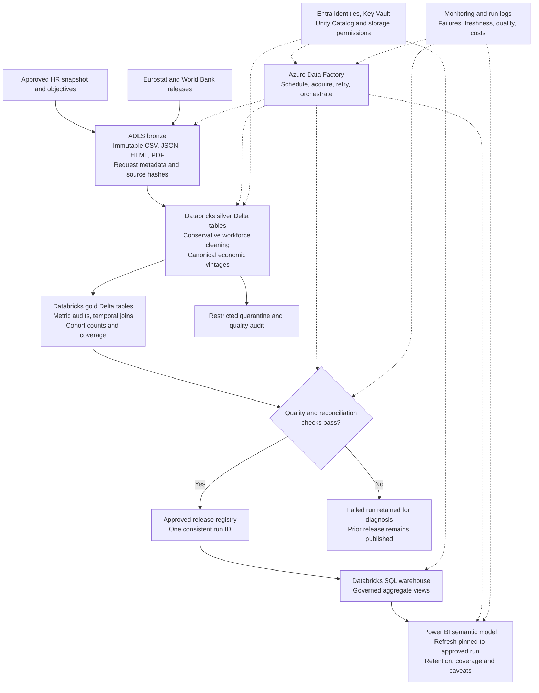

# Production architecture mapping

Proposed design, reviewed 2026-09-27. The implemented product runs locally with Python, SQLite and an offline HTML dashboard. No Azure resources, Databricks jobs or Power BI deployment have been provisioned or tested. This mapping explains how to retain the same analytical contracts in a production environment; it is not a deployment claim or a prerequisite for reviewing the assessment.

## Architecture view

Solid arrows show data flow; dotted arrows show orchestration and shared controls. Bronze stores source evidence, silver stores validated records, and gold stores consumption-ready results. Each published release is tied to one validated run.

This layer pattern follows the separation described in [Databricks medallion architecture](https://learn.microsoft.com/en-us/azure/databricks/lakehouse/medallion). The publication gate and release registry are proposed application controls; merely using Delta tables does not provide an atomic multi-table release.

## Mapping from the repository

**Orchestration:** `scripts/run_pipeline.py` becomes an ADF pipeline coordinating acquisition, Databricks processing, validation and report refresh. Keep acquisition separate from deterministic replay. Pass snapshot date, source-manifest version, code version and run ID explicitly. ADF can invoke Databricks notebook activities; thin wrappers would call packaged transformation code rather than duplicate business rules in notebooks. [ADF Databricks notebook activity](https://learn.microsoft.com/en-us/azure/data-factory/transform-data-using-databricks-notebook).

**Bronze:** `data/raw` and manifest-listed external files map to immutable ADLS paths, organized by provider, dataset, retrieval batch and content hash. Keep original response bytes, exact requests, UTC retrieval timestamps, release evidence and failure diagnostics. A new revision is a new object, not an overwrite of the earlier vintage. Store the raw HR snapshot in a separately restricted location from public statistics.

**Silver:** `clean_assessment.py` and historical release parsers map to versioned workforce and economic-vintage Delta tables. Workforce identity includes snapshot and employee ID; economic identity includes country, indicator, dimensions, reference period and vintage. Preserve originals, source hashes, quality flags and exclusions. Missing countries remain unknown; invalid dates go to quarantine; generator recovery is not deployed. Conflicting employee IDs or ambiguous economic versions fail validation. Large inputs would require distributed implementations validated against current fixtures, not a claim that the existing Python loops scale unchanged.

**Gold:** the three metric calculators, temporal joins and association outputs become run-scoped facts and aggregate tables. Store counts and employee-days alongside rates. Preserve native economic frequency and exact historical availability. SQL reconciliation remains a publication gate. Cohort facts retain country, business unit, hire period, objective, eligibility and outcome. Release metadata records inputs, code, policy, quality counts and lineage.

**Consumption:** SQLite reporting views map to governed views in a Databricks SQL warehouse. Power BI replaces the local HTML consumption layer; the local dashboard remains the assessment deliverable. Import mode is the proposed starting point for a small periodic reporting workload; evaluate DirectQuery only if freshness or data volume justifies it. The connector supports both modes. [Power BI integration](https://learn.microsoft.com/en-us/azure/databricks/partners/bi/power-bi).

## Scheduling and incremental processing

Proposed cadence: ingest an HR snapshot after the source owner declares it complete; check public releases daily, with a bounded retry window and backoff. Monthly unemployment, quarterly vacancies and annual CPI retain their native periods even though discovery runs daily. The cadence is a design assumption, not an existing service-level agreement.

Skip already-verified identical content. Process newly acquired or revised vintages and rebuild affected reporting partitions with the same deterministic rules. Retain full replay for audit and recovery. Updates to a historical vintage can change eligible later cutoffs, so incremental invalidation must follow affected country/indicator/date ranges rather than only the latest month. A revised employee snapshot must not silently rewrite a previously published snapshot.

Use a run identity based on snapshot, input manifest, transformation version and configuration. Repeated retries of the same run must not append duplicate employees, observations or cohort facts. Serialize publication per reporting snapshot or use a conditional update on the release registry to prevent concurrent runs from publishing out of order.

## Publication, rollback and failure handling

Write all gold outputs under a candidate run ID. Validate schema, hashes, uniqueness, row reconciliation, metric denominators, temporal boundaries and SQL/Python agreement before marking the run approved. Expected missingness is reported, not automatically treated as failure; changed quality levels trigger owner review against agreed thresholds. Corrupt source evidence and violated invariants stop publication.

All consumer views must select one approved run ID. Advance the release registry only after all required candidate tables exist and pass checks. Pin the Power BI refresh to that run ID so queries across tables cannot mix releases if another run completes during refresh. Keep the previous semantic-model release available until refresh succeeds; if refresh fails, show the previous publication time and alert the owner. Refresh consistency and rollback behavior require integration tests before production use.

Rollback selects a previously approved immutable run and refreshes consumption from it. Do not mutate raw evidence to make a failed run pass. Failed candidate data remains restricted and available for diagnosis under a defined retention policy.

The current local pipeline only removes its success manifest on failure and stages SQLite replacement. It can leave mixed-generation files and an old dashboard. The proposed run-scoped publication scheme closes that gap; it is not already implemented locally.

## Identity, secrets and access control

Use dedicated workload identities and least-privilege roles for acquisition, transformation, publication and report refresh. Prefer managed identity where the selected connector supports it. Store any required credentials in Azure Key Vault and reference them through approved connections; do not embed secrets in scripts, notebooks, manifests or CI logs. ADF supports Key Vault references through its managed identity. [ADF Key Vault integration](https://learn.microsoft.com/en-us/azure/data-factory/store-credentials-in-key-vault).

Use Unity Catalog grants for Databricks data access and corresponding Azure storage permissions for the underlying files. Do not assume catalog controls block a principal that separately has broad direct storage access. Restrict employee-level bronze, silver, quarantine and audit access to authorized HR/data roles. Analysts normally consume aggregates; publication and source correction are separate privileges.

Power BI import creates another data copy: enforce its workspace permissions and appropriate row-level security independently of warehouse grants. Report viewers must not receive broad workspace authoring access as a substitute for row-level access. Test restrictions with real viewer identities. Define small-cohort disclosure rules with HR before using real employee records; the analytical ten-hire sensitivity check is not a privacy policy.

Separate public-statistics egress from restricted HR ingestion. Use approved private connectivity for storage and compute where required, restrict outbound destinations, and log administrative access. Define retention/deletion and encryption requirements with the data owner. These are proposed controls for real data, not assertions about deployed security in this fictional exercise.

## Observability and operational ownership

Attach the run ID to ADF activity logs, Databricks job logs, validation results, publication metadata and report refresh records. Send operational logs and alerts to the organization's monitoring platform, such as Azure Monitor/Log Analytics. Track failures, retry exhaustion, duration, source hashes, changed schemas, unknown countries, quarantines, per-indicator match coverage, source age, publication lag and compute consumption.

Distinguish a successful run with partial historical coverage from a failed run or stale report. Display workforce as-of date, approved run ID, publication time and source coverage in consumption. Avoid employee details or credentials in general-purpose logs. Proposed ownership: data engineering handles execution and evidence failures; the HR data owner resolves source semantics; the BI owner handles access and refresh failures. Response targets must be agreed, not invented in this assessment.

## Development, testing and environment promotion

Maintain separate development, test and production workspaces/storage, catalogs, identities, secrets and BI workspaces. Define infrastructure and permissions as reviewed versioned configuration. Package transformations and dependencies as a versioned artifact; promote the same artifact through environments with environment-specific connection references. Do not copy production HR snapshots into development by default.

CI runs fixture-based unit tests, schema/temporal checks and SQL reconciliation. Test adds controlled integration data, publication-failure injection, retry idempotence, concurrent-run behavior, access tests and semantic-model refresh checks. Production promotion requires reviewed results and the organization's release approval; database and semantic-model schema changes need compatibility and rollback plans. Current 68-test local verification is evidence for business logic, not validation of these cloud controls.

## Cost, scale and completion boundary

Keep batch compute and the SQL warehouse bounded and automatically stopped when idle where supported. Partition for real query volume rather than creating tiny tables/files per employee. Prefer aggregate report queries and incrementally rebuild only proven affected partitions. Benchmark before choosing cluster size, refresh frequency or capacity; no price or throughput estimate is claimed.

The mapping requirement is satisfied by this proposed view and its controls. Production deployment would still require implementation, environment-specific security review, source contracts, operating budgets, monitoring ownership and end-to-end acceptance tests. No paid infrastructure is needed to run the submitted local assessment.
